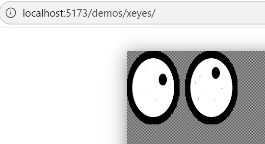

# EmX11

⚠️ This project is in early development and is not yet stable. Expect breaking changes and missing features.

A WebAssembly implementation of the X11/Xlib C API that renders X windows to a browser Canvas — no real X server required.



Built on top of [X.Org](https://www.x.org/) (xorgproto, libX11, libXt, libXaw), compiled with Emscripten and composited onto Canvas via a TypeScript runtime.

# Prerequisites

- Linux (or WSL)
- Emscripten (latest emsdk recommended; `emcc` must be on `PATH`)
- Node.js ≥ 20, pnpm ≥ 9
- cmake ≥ 3.20, make, git

```bash
pnpm install
bash scripts/fetch-third-party.sh
```

# Build

```bash
pnpm build
```

# Run

```bash
pnpm dev
```

# Documentation

No API documentation yet — the project is still unstable.

# License

MIT. Third-party X.Org code under `third-party/` and `native/include/` retains its original MIT / X Consortium license.
