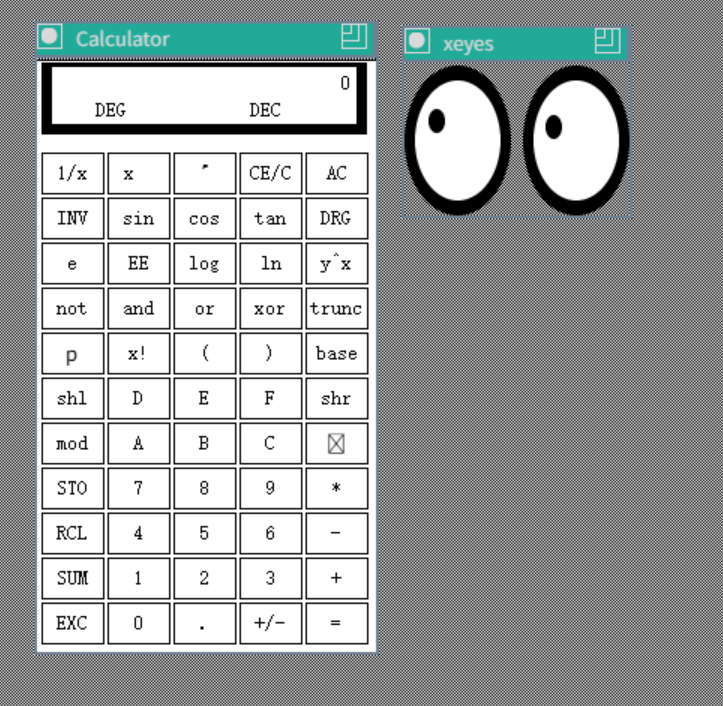

# EmX11

⚠️ This project is in early development and is not yet stable. Expect breaking changes and missing features.

A WebAssembly implementation of the X11/Xlib C API that renders X windows to a browser Canvas — no real X server required.




# Prerequisites

- Linux (or WSL)
- Emscripten (latest emsdk recommended; `emcc` must be on `PATH`)
- Node.js ≥ 20, pnpm ≥ 9
- cmake ≥ 3.20, make, git

```bash
pnpm install
bash scripts/fetch-third-party.sh
```

# Build

```bash
pnpm build
```

# Run

```bash
pnpm dev
```

# Documentation

The JS API surface is documented in [docs/api.md](docs/api.md).

# License

MIT. Third-party X.Org code under `third-party/` and `native/include/` retains its original MIT / X Consortium license.
