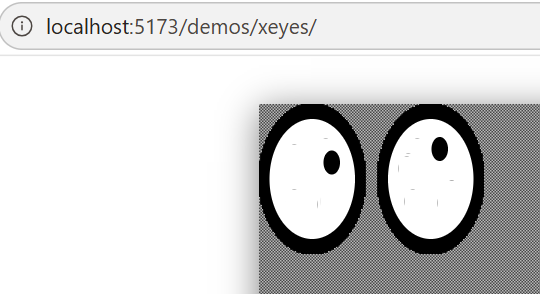

# EmX11

⚠️ This project is in early development and is not yet stable. Expect breaking changes and missing features.

A WebAssembly implementation of the X11/Xlib C API that renders X windows to a browser Canvas — no real X server required.



Built on top of [X.Org](https://www.x.org/) (xorgproto, libX11, libXt, libXaw), compiled with Emscripten and composited onto Canvas via a TypeScript runtime.

# Prerequisites

- Linux (or WSL)
- Emscripten (latest emsdk recommended; `emcc` must be on `PATH`)
- Node.js ≥ 20, pnpm ≥ 9
- cmake ≥ 3.20, make, git

```bash
pnpm install
bash scripts/fetch-third-party.sh
```

# Build

```bash
pnpm build
```

# Run

```bash
pnpm dev
```

# Architecture

em-x11 exposes two entry points; pick based on how many wasm X clients
you need to host:

- **`Orchestrator`** ([src/worker/main-thread/orchestrator.ts](src/worker/main-thread/orchestrator.ts)) —
  multi-worker runtime. Main thread is a thin DOM-input forwarder; a
  Server Worker owns an OffscreenCanvas + the window tree; each wasm
  client (twm, xeyes, xcalc, …) runs in its own Client Worker and
  talks to the server over a dedicated `MessageChannel`. Mirrors
  xorg's server-process + client-process model. Recommended for any
  multi-client setup (WMs, session demos).

- **`Host`** ([src/host/index.ts](src/host/index.ts)) — single-threaded
  runtime where one wasm client shares the main JS thread with the
  X "server" logic. Simpler, no workers or OffscreenCanvas. Used by
  wacl-tk / pyodide-tk integrations and by the trivial single-client
  demos (`demos/hello`, `demos/xeyes`, `demos/xt-hello`).

The same `libemx11` C archive works against both runtimes — the EM_JS
bridges detect `globalThis.__EMX11_CHANNEL__` (worker) vs
`globalThis.__EMX11__` (host) at runtime.

# Documentation

No API documentation yet — the project is still unstable.

# License

MIT. Third-party X.Org code under `third-party/` and `native/include/` retains its original MIT / X Consortium license.
